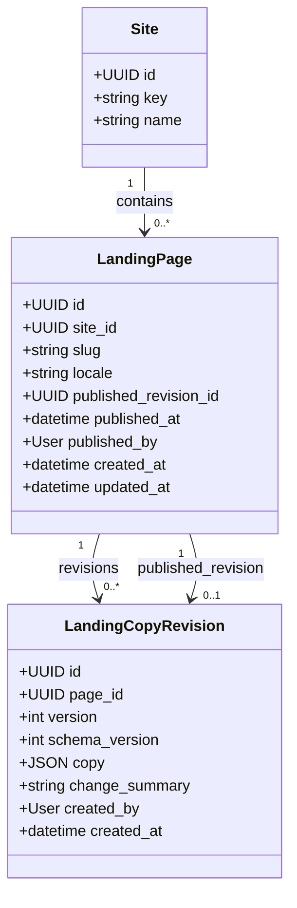

# Landing copy API — public read and staff publication

**Status:** Persistence, initial unpublished drafts, public read endpoint, staff model editing, and publication form implemented.
**Reference:** Jung landing image supplied on September 21, 2026.
**Scope:** Text only. Next.js owns the section layout, order, components, artwork, icons, and action destinations. The implemented contract uses a fixed copy shape instead of arbitrary ordered sections.

## Public endpoint

```http
GET /api/v1/sites/{site_key}/pages/{page_slug}/?locale=es-CO
Accept: application/json
```

The initial request is /api/v1/sites/jung/pages/home/?locale=es-CO. It returns exactly one complete published revision, or 404 while that locale is unpublished. JSON and DRF's browsable HTML are rendered. The route accepts anonymous reads and exposes no drafts or public writes. A successful response carries Cache-Control: public, max-age=60.

| Status | Meaning                                                 |
| ------ | ------------------------------------------------------- |
| 200    | Published copy in the requested locale                  |
| 400    | Malformed site key, page slug, or locale                |
| 404    | No published copy for that exact site, page, and locale |

A site key names public content. It does not establish tenant isolation or authorization.

## Django models

These three project-owned models are implemented. Django's configured User model supplies creator and publisher identities; it is not a new Jung model. The creator field is nullable for migration-seeded drafts and if a user is later deleted.



| Model               | Key rules                                                                                                                                                   |
| ------------------- | ----------------------------------------------------------------------------------------------------------------------------------------------------------- |
| Site                | key is unique; Jung is the first record.                                                                                                                    |
| LandingPage         | The combination of site, slug, and locale is unique. published_revision is nullable before the first publication and must point to a revision of this page. |
| LandingCopyRevision | The combination of page and version is unique. Revisions are immutable after creation. schema_version describes the validated copy shape.                   |

The live version is the LandingPage.published_revision pointer. The models enforce that a selected revision belongs to its page and has a publication timestamp. A staff member reviews a complete draft at /api/v1/editor/sites/{site_key}/pages/{page_slug}/?locale={locale}, enters its version, confirms review, and publishes through the POST form. The transaction sets the pointer, timestamp, and publisher. Selecting an older version provides rollback. The current model stores only the latest publication metadata; structured logs record publication actions. Agents and developers should provide change_summary before review.

## Staff model editing API

Staff can browse /api/v1/editor/data/ after signing in through /api-auth/login/. Sites and pages support GET, POST, PUT, PATCH, and DELETE. A site with pages cannot change its key or be deleted; a page with revisions cannot change its site, slug, or locale or be deleted. These guards return 409.

Revisions support GET and POST. A POST creates the next version for a page from a complete validated copy document and a change_summary. PUT or PATCH on an existing revision creates a new version and returns 201 with the new resource URL in Location. PUT takes complete copy; PATCH recursively merges a partial copy into the selected source and validates the result. The original revision is unchanged. Revision DELETE is disabled. The page's published_revision and publication metadata are read-only here; staff must use the separate confirmed publication form. All staff model responses are private and non-cacheable.

## Copy fields

The JSON copy field has named groups matching the established frontend sections. It is not a generic page builder. Repeated text items keep stable IDs so frontend icons and placement remain in code.

| Group       | Text fields                                                                       |
| ----------- | --------------------------------------------------------------------------------- |
| seo         | title, description                                                                |
| shared_text | navigation_labels, action_labels, footer_tagline                                  |
| hero        | eyebrow, heading_lead, heading_accent, description, side_note, highlights[].label |
| trust       | eyebrow, testimonial.quote, testimonial.attribution                               |
| problem     | eyebrow, heading, description, items[].label                                      |
| solution    | eyebrow, heading, description, items[].heading, items[].description               |
| results     | eyebrow, heading, description, items[].value, items[].label, items[].description  |
| audiences   | eyebrow, heading, description, items[].heading, items[].description               |
| closing_cta | left_note, heading, description, right_note                                       |

The frontend controls which groups it renders and their order. trust and results may be absent if their testimonial or numerical claims have not been verified. Within an existing section, item IDs and counts follow the frontend component contract; editors cannot add arbitrary layout variants through text data.

## Example response

The following sample preserves the wording transcribed from the reference design. The quote and performance metrics are examples, not verified claims ready to publish. The actual seed omits trust and results entirely and creates separate unpublished drafts for es-CO and en-US.

```json
{
  "schema_version": 1,
  "site_key": "jung",
  "page_slug": "home",
  "locale": "es-CO",
  "revision": 1,
  "published_at": "2026-09-21T17:00:00Z",
  "copy": {
    "seo": {
      "title": "Jung | Convierte conversaciones en citas",
      "description": "Tu página web, WhatsApp, IA y calendario trabajando juntos para que ninguna oportunidad se pierda."
    },
    "shared_text": {
      "navigation_labels": {
        "solutions": "Soluciones",
        "how_it_works": "Cómo funciona",
        "use_cases": "Casos de uso",
        "pricing": "Precios",
        "faq": "FAQ",
        "contact": "Contacto"
      },
      "action_labels": {
        "book_demo": "Agendar demo",
        "watch_demo": "Ver Jung en acción"
      },
      "footer_tagline": "Más allá de lo posible."
    },
    "hero": {
      "eyebrow": "Sistemas inteligentes para un mundo en evolución",
      "heading_lead": "Convierte conversaciones",
      "heading_accent": "en citas.",
      "description": "Tu página web, WhatsApp, IA y calendario trabajando juntos para que ninguna oportunidad se pierda y tu negocio siga creciendo.",
      "side_note": "Inteligencia que expande horizontes",
      "highlights": [
        {
          "id": "opportunities",
          "label": "Más oportunidades de venta"
        },
        {
          "id": "time",
          "label": "Menos tiempo en tareas manuales"
        },
        {
          "id": "always_on",
          "label": "Un proceso comercial siempre activo"
        }
      ]
    },
    "trust": {
      "eyebrow": "Confianza en empresas en crecimiento",
      "testimonial": {
        "quote": "Jung nos ayudó a automatizar nuestro proceso comercial y hoy tenemos más citas cada semana.",
        "attribution": "Cliente PyME"
      }
    },
    "problem": {
      "eyebrow": "El problema",
      "heading": "Tienes contactos, pero se pierden.",
      "description": "Generas interés en tu página, redes o WhatsApp, pero la mayoría de esos contactos no se convierten en oportunidades reales.",
      "items": [
        {
          "id": "late_replies",
          "label": "Respuestas tardías"
        },
        {
          "id": "lost_conversations",
          "label": "Conversaciones que se pierden"
        },
        {
          "id": "manual_followup",
          "label": "Seguimiento manual"
        },
        {
          "id": "disconnected_tools",
          "label": "Herramientas desconectadas"
        },
        {
          "id": "unanswered_prospects",
          "label": "Prospectos que dejan de responder"
        }
      ]
    },
    "solution": {
      "eyebrow": "La solución",
      "heading": "Un sistema completo para tu crecimiento.",
      "description": "Jung conecta tu página web, WhatsApp, inteligencia artificial y calendario en un solo flujo comercial, para que puedas atraer, conversar, dar seguimiento y agendar más citas, sin fricción.",
      "items": [
        {
          "id": "attract",
          "heading": "Atrae",
          "description": "El prospecto llega desde tu página, campaña o canal."
        },
        {
          "id": "converse",
          "heading": "Conversa",
          "description": "La IA responde, califica y mantiene la conversación."
        },
        {
          "id": "follow_up",
          "heading": "Da seguimiento",
          "description": "El sistema realiza recordatorios y mensajes automáticos."
        },
        {
          "id": "book",
          "heading": "Agenda",
          "description": "El prospecto elige un horario en tu calendario."
        },
        {
          "id": "sell",
          "heading": "Vende más",
          "description": "Convierte más oportunidades en clientes."
        }
      ]
    },
    "results": {
      "eyebrow": "Resultados reales",
      "heading": "Más citas. Más ventas. Más crecimiento.",
      "description": "Empresas como la tuya ya están usando Jung para acelerar su crecimiento comercial.",
      "items": [
        {
          "id": "bookings",
          "value": "+40%",
          "label": "más citas agendadas",
          "description": "en los primeros 3 meses."
        },
        {
          "id": "time_saved",
          "value": "-70%",
          "label": "menos tiempo",
          "description": "en tareas manuales de seguimiento."
        },
        {
          "id": "conversions",
          "value": "+3x",
          "label": "más oportunidades",
          "description": "convertidas en clientes."
        }
      ]
    },
    "audiences": {
      "eyebrow": "Ideal para",
      "heading": "Funciona para diferentes tipos de negocios.",
      "description": "Cualquier empresa que reciba consultas, cotizaciones o agende citas puede beneficiarse de Jung.",
      "items": [
        {
          "id": "retail",
          "heading": "Comercio minorista",
          "description": "Tiendas, boutiques, servicios locales."
        },
        {
          "id": "wellness",
          "heading": "Salud y bienestar",
          "description": "Clínicas, consultorios, centros de estética."
        },
        {
          "id": "education",
          "heading": "Educación",
          "description": "Academias, cursos, formación profesional."
        },
        {
          "id": "b2b",
          "heading": "Servicios B2B",
          "description": "Consultoras, agencias, proveedores."
        },
        {
          "id": "hospitality",
          "heading": "Hospitalidad",
          "description": "Restaurantes, hoteles, eventos."
        }
      ]
    },
    "closing_cta": {
      "left_note": "Un futuro más conectado comienza hoy.",
      "heading": "¿Listo para convertir más oportunidades en clientes?",
      "description": "Agenda una demostración y descubre cómo Jung puede impulsar tu negocio.",
      "right_note": "Ideas, personas, sistemas: un mañana más amplio."
    }
  }
}
```

## Validation and ownership

- Validate the whole copy document on draft creation and again before publication. Require known groups, known item IDs, plain-text strings, and field-specific length limits. Reject HTML, CSS, JavaScript, arbitrary links, and unknown keys.
- Keep the response shape versioned. A new visual section or different text structure requires a reviewed schema change and a frontend release. Ordinary copy edits do not require a redeploy.
- Keep CTA destinations, navigation URLs, images, logos, icons, colors, and layout in frontend configuration. The hero laptop and phone mockup text is outside this API if embedded in artwork.
- The public endpoint exposes only published content. The browsable editor exposes drafts only to staff, requires a login and CSRF token, and publishes only after explicit confirmation. The staff model API creates new revisions; publication remains a separate confirmed action.
- Successful responses advertise a 60-second public cache lifetime. The frontend must honor compatible freshness rules for edits to appear without redeployment. Backend-outage behavior remains undecided.
- A human must verify permission for any testimonial or customer logo and evidence for performance metrics before publication.

## Decisions for review

1. Should the hero mockup messages be editable HTML text, or remain embedded in a fixed image?
2. What evidence supports the testimonial and result metrics in the reference design?
3. Is a maximum freshness delay of 60 seconds acceptable for the frontend and deployment cache?
